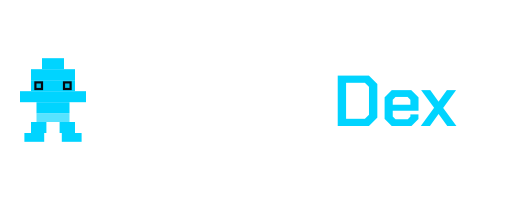

<p align="center">
  
</p>

<p align="center">
  <strong>Your Ultimate Game Companion</strong>
</p>

<p align="center">
  Track items, complete collections, and conquer every game with purpose-built tracker companions.
</p>

---

## About

GamerDex is a collection of game-specific tracker companions designed for players who want to see and do everything. Each tracker is hand-crafted with accurate, up-to-date game data and designed to be used alongside your gameplay.

### Current Trackers

- **Dinkum Tracker** — Catalog every fish, bug, item, and more
- **Stardew Valley Companion** — Track bundles, collections, and community center progress
- **Supermarket Simulator Buddy** — Stock every shelf and manage your inventory

## Tech Stack

- [Next.js](https://nextjs.org/) 16 (App Router)
- [React](https://react.dev/) 19
- [Tailwind CSS](https://tailwindcss.com/) 4
- [Flowbite React](https://flowbite-react.com/)
- [TypeScript](https://www.typescriptlang.org/)
- Deployed on [Vercel](https://vercel.com/)

## Getting Started

### Prerequisites

- [Node.js](https://nodejs.org/) 24+
- [pnpm](https://pnpm.io/) 10+

### Installation

```bash
pnpm install
```

### Development

```bash
pnpm dev
```

Open [http://localhost:3000](http://localhost:3000) in your browser.

### Build

```bash
pnpm build
```

### Lint & Format

```bash
pnpm lint
pnpm format
pnpm format:check
```

## License

All rights reserved.
